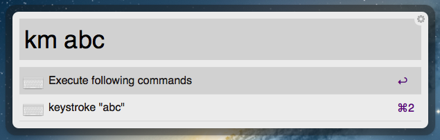
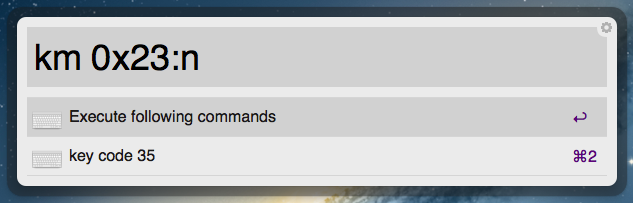
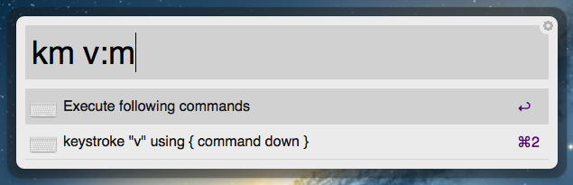

KeyMacro.alfredworkflow
=======================

[Download KeyMacro.alfredworkflow](https://drone.io/github.com/ts123/KeyMacro.alfredworkflow/files/bin/KeyMacro.alfredworkflow) from drone.io

Screenshots
------------
send "abc" keys to the previous application

send keycode 0x23
(you can set several options after a colon. "n" option cause to parse string as keycode number)

send ⌘v 
("m" option has the command modifier enabled)

key commands can be combined with comma separators

Dependencies
------------
KeyMacro uses [alfred-python](https://github.com/nikipore/alfred-python)
